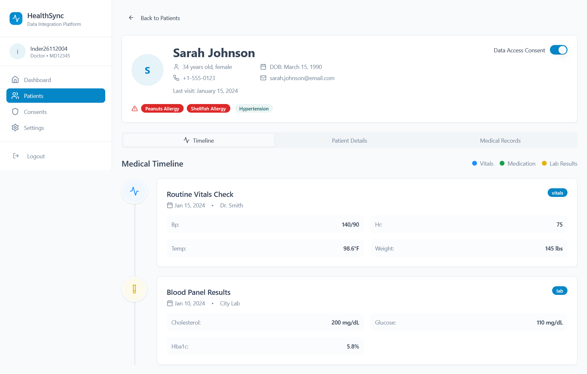
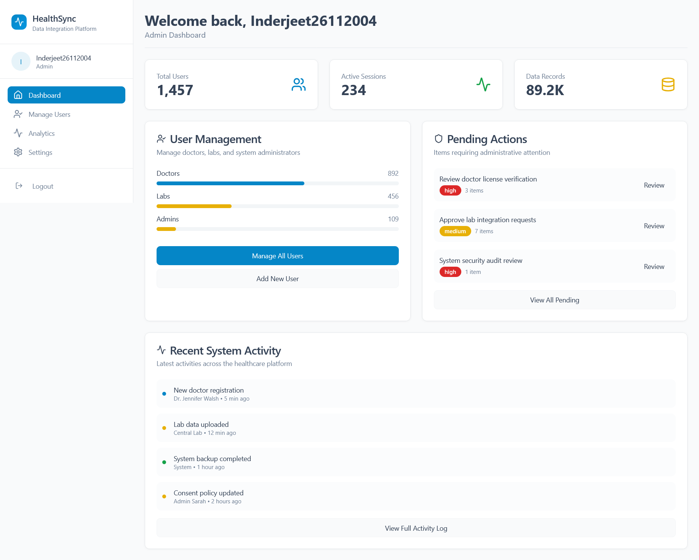
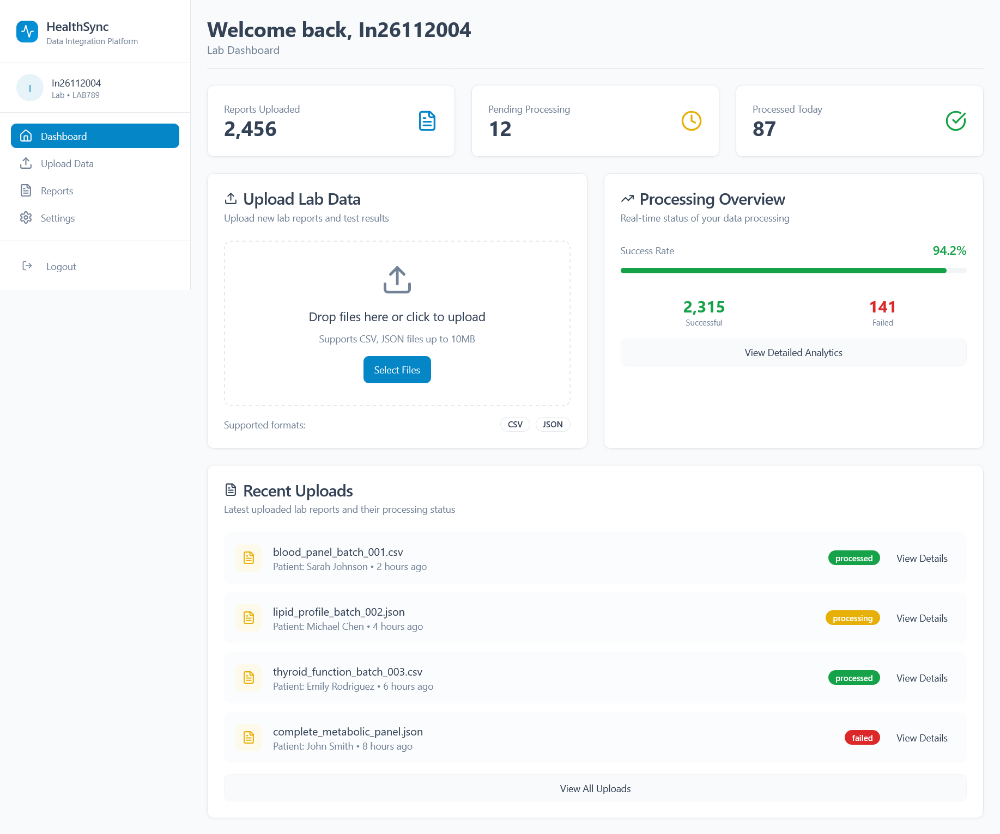
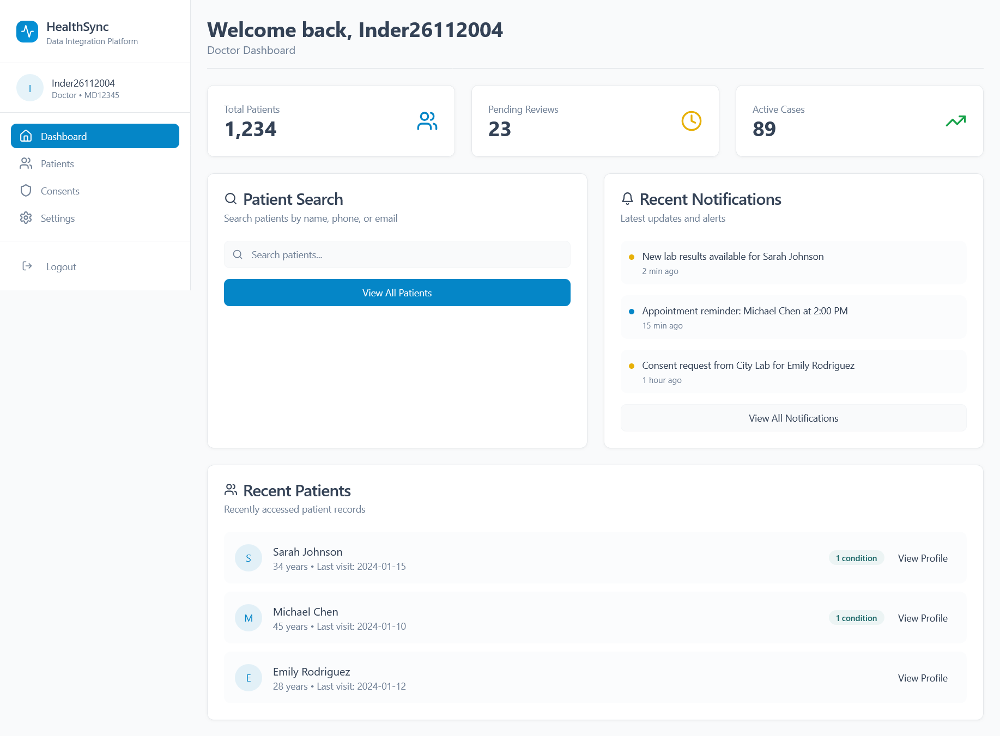

# Healthbridge

`Short Description`: Healthbridge is a cloud data storage and manage data storage for Doctors, Patients and Organisations.


A secure, centralized platform for patients, doctors, and organizations to store, access, and share health records globally using unique IDs.

## Table of Contents
- [Features](#features)
- [Installation](#installation)
- [Usage](#usage)
- [Screenshots](#screenshots)
- [Configuration](#configuration)
- [Contributing](#contributing)
- [License](#license)
---
## Features
- **Patients**: View and share health records via unique ID.
- **Doctors**: Access patient data and update medical prescriptions.
- **Organizations**: Monitor aggregated health trends and compliance can update new data `eg: medical report`

---

**Use your preferred IDE**

Follow these steps:

```sh
# Step 1: Clone the repository using the project's Git URL.
git clone https://github.com/Inder-26/HealthBridge.git

# Step 2: Navigate to the project directory.
cd HealthBridge

# Step 3: Install the necessary dependencies.
npm install

# Step 4: Start the development server with auto-reloading and an instant preview.
npm run dev
```

**Edit a file directly in GitHub**

- Navigate to the desired file(s).
- Click the "Edit" button (pencil icon) at the top right of the file view.
- Make your changes and commit the changes.

**Use GitHub Codespaces**

- Navigate to the main page of your repository.
- Click on the "Code" button (green button) near the top right.
- Select the "Codespaces" tab.
- Click on "New codespace" to launch a new Codespace environment.
- Edit files directly within the Codespace and commit and push your changes once you're done.

## What technologies are used for this project?

This project is built with:

- Vite
- TypeScript
- React
- shadcn-ui
- Tailwind CSS
- Python
- Yellow Blockchain

## Usage
### For Patients:
- Log in with your E-Mail ID.
- View your Medical reports, Prescriptions, and other medical details.

### For Doctors:
- Search patients by Health ID.
- Access real-time lab results and prescribe treatments.

### For Organizations:
- Generate analytics reports on public health trends.
- Manage doctor and patient registrations.
---
## Screenshots
- User-Interface for Patients



- User-Interface for ADMIN DASHBOARD



- User-Interface for lab techenician



- User-Interface for doctors



---
## Contributing
1. Fork the repository.
2. Create a feature branch: `git checkout -b feature/new-feature`.
3. Commit changes: `git commit -m 'Add new feature'`.
4. Push to the branch: `git push origin feature/new-feature`.
5. Submit a pull request.

---

## License

This project is licensed under the MIT License. See [LICENSE](LICENSE) for details.

---

## Contact
For any queries, [Mail Here](mailto:nishantpartapsavita1@gmail.com)